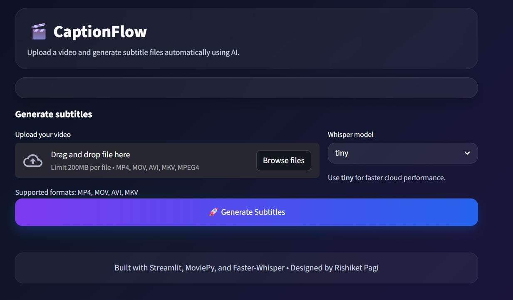

# 🎬 CaptionFlow – AI Video Subtitle Generator

CaptionFlow is an AI-powered web application that automatically generates subtitles from uploaded videos.
The app extracts audio, transcribes speech using Faster-Whisper, and produces a downloadable `.srt` subtitle file.

🔗 Live App: https://rishiketpagi-captionflow.streamlit.app
🔗 GitHub Repo: https://github.com/rishiketpagi/captionflow

---

## 🚀 Features

* Upload video files (MP4, MOV, AVI, MKV)
* Automatic audio extraction
* Speech-to-text transcription using Faster-Whisper
* Subtitle generation with timestamps
* Download subtitles as `.srt`
* Clean modern UI with custom styling
* Works directly in browser

---

## 🧠 Tech Stack

* Python
* Streamlit
* Faster-Whisper
* MoviePy
* ImageIO
* Custom CSS

---

## 📸 Screenshot

Add screenshot after uploading image to repo.

Example:



---

## ⚙️ Run Locally

Clone the repo

```bash
git clone https://github.com/rishiketpagi/captionflow.git
cd captionflow
```

Create virtual environment

```bash
python -m venv venv
venv\Scripts\activate
```

Install dependencies

```bash
pip install -r requirements.txt
```

Run app

```bash
streamlit run app.py
```

---

## ☁️ Deployment

This project is deployed using Streamlit Community Cloud.

Steps:

1. Push code to GitHub
2. Connect repo to Streamlit Cloud
3. Select app.py
4. Deploy

---

## 📌 Notes

* Use short videos for best performance
* Tiny model recommended for cloud
* Large videos may take longer

---

## ⭐ Future Improvements

* Subtitle translation
* Transcript download
* Editable subtitles
* Multiple languages
* Video summary
* Speaker detection

---

## 👨‍💻 Author

Rishiket Pagi
Computer Engineering Student

GitHub: https://github.com/rishiketpagi
LinkedIn: https://www.linkedin.com/in/rishiket-pagi
